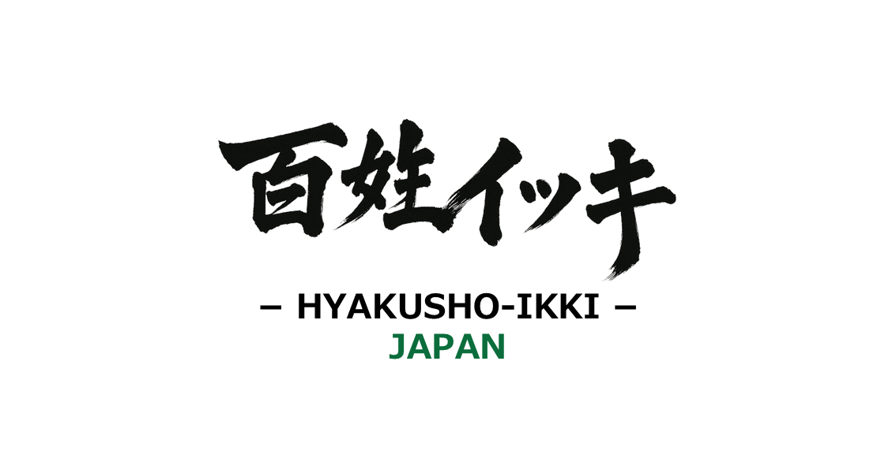

# 株式会社百姓イッキ | HYAKUSHO IKKI, Inc.



## 概要

「株式会社百姓イッキ」の公式ランディングページです。一次産業を次世代へ継承し、日本の未来を耕す農業スタートアップとして、静岡県沼津市を拠点に活動しています。

🌐 **公式サイト**: [https://100ikki.com/](https://100ikki.com/)

## 事業内容

- **高収益生産モデル(FARM)**: テクノロジーを活用した生産性向上
- **サプライチェーン改革(SCM)**: 流通の効率化と最適化
- **農業参入基盤(OS)**: 新規就農者向けプラットフォーム構築

若者が活躍する持続可能な食料生産インフラの創造を目指しています。

## 技術スタック

- **HTML5**: セマンティックマークアップ
- **CSS3**: カスタムプロパティとレスポンシブデザイン
- **JavaScript**: インタラクティブな機能実装
- **Chart.js**: データビジュアライゼーション
- **Lenis**: スムーススクロール
- **Phosphor Icons**: アイコンライブラリ

## 主な機能

- レスポンシブデザイン（モバイル・タブレット・デスクトップ対応）
- SEO最適化（構造化データ、OGP対応）
- スムーススクロール
- Google Analytics統合
- 多言語対応準備

## プロジェクト構成

```
.
├── index.html          # メインHTMLファイル
├── OGP.png            # OGP画像
├── 5IKKI.png          # ロゴ画像
├── logo_sq_trans.png  # 正方形ロゴ（透過）
├── logo_trans.png     # ロゴ（透過）
├── YoshikiSaito_pic.png    # CEO画像
├── YoshikiSaito_pic_sq.png # CEO画像（正方形）
├── robots.txt         # 検索エンジン設定
└── sitemap.xml        # サイトマップ
```

## ローカル開発

このプロジェクトは静的HTMLサイトのため、シンプルなHTTPサーバーで起動できます。

### 方法1: Python（推奨）
```bash
python -m http.server 8000
```

### 方法2: Node.js (http-server)
```bash
npx http-server -p 8000
```

ブラウザで `http://localhost:8000` にアクセスしてください。

## デプロイ

静的サイトのため、以下のプラットフォームで簡単にデプロイ可能です：

- Vercel
- Netlify
- GitHub Pages
- Cloudflare Pages

## 会社情報

- **会社名**: 株式会社百姓イッキ
- **英語名**: HYAKUSHO IKKI, Inc.
- **所在地**: 静岡県沼津市
- **メール**: info@100ikki.com
- **ウェブサイト**: https://100ikki.com/

## ライセンス

© 2024-2026 HYAKUSHO IKKI, Inc. All rights reserved.

---

*一次産業を次世代へ継承し、日本の未来を耕す。*
